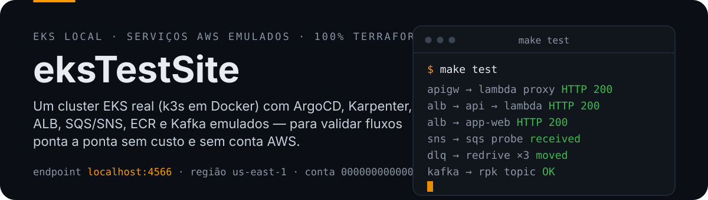
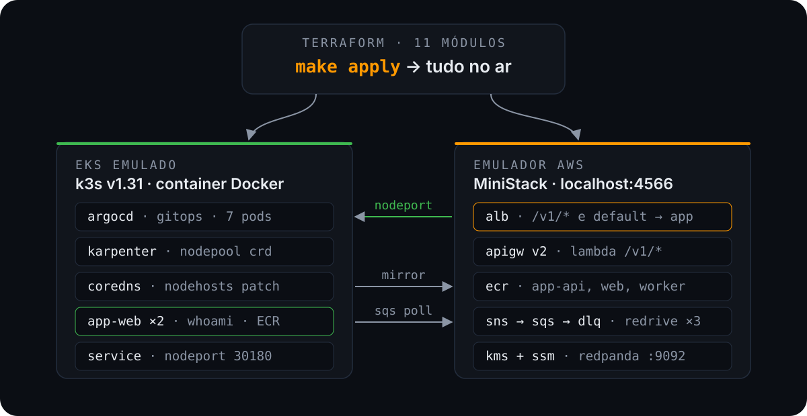

<p align="center">
  
</p>

# eksTestSite

**Cluster EKS real (k3s em Docker) + serviços AWS emulados no `localhost:4566` — para validar fluxos ponta a ponta de plataforma sem custo e sem conta AWS.** ArgoCD, Karpenter, ALB, API Gateway, Lambda, ECR, SNS/SQS com DLQ, KMS, SSM e Kafka, tudo provisionado por Terraform e verificado por um único comando.

## Prova

Saída real de `make test` — todas as validações são determinísticas (não dependem de timing nem competem com controllers do cluster):

```
apigw  → lambda proxy     HTTP 200
alb    → api → lambda    HTTP 200
alb    → app-web         HTTP 200   ← whoami servindo do ECR local
sns    → sqs probe       received
dlq    → redrive ×3      moved      ← mensagem estoura maxReceiveCount e cai no DLQ
kafka  → rpk topic       OK
```

## Arquitetura

<p align="center">
  
</p>

Três planos:

1. **Terraform (host)** — 11 módulos; `make apply` sobe tudo.
2. **EKS emulado** — k3s `v1.31` em container Docker, com ArgoCD (GitOps), Karpenter (NodePool), CoreDNS e o app de teste `app-web` (whoami, 2 réplicas, imagem do ECR local).
3. **Emulador AWS (MiniStack)** — `localhost:4566`, região `us-east-1`, conta `000000000000`.

Fluxos entre os planos: o tráfego HTTP entra pelo **ALB** e alcança o app via **NodePort 30180**; o containerd do k3s puxa imagens do **ECR** por um mirror (`000000000000.dkr.ecr.us-east-1.amazonaws.com` → `host.docker.internal:4566`); o **Karpenter** escuta a `ministack-queue` SQS como interruption queue.

## Stack provisionada

| Camada | O que é | Como acessa |
|---|---|---|
| **EKS** | k3s real (`v1.31.4+k3s1`) em container Docker | `https://localhost:16443` (proxy godoxy) |
| **ArgoCD** | 7 pods (server, controller, dex, redis, repo-server…) | `kubectl -n argocd` / senha via secret |
| **Karpenter** | Controller + NodePool CRD (provisioning emulado) | `kubectl -n karpenter` |
| **API Gateway v2** | REST API + Lambda proxy | `http://<api-id>.execute-api.localhost:4566` |
| **Lambda** | `ministack-api-proxy` (função `/v1/*`) | via APIGW ou ALB |
| **ALB** | `/v1/*` → APIGW · default → `app-web` | `localhost:4566` com header `Host` |
| **App de teste** | `app-web` (whoami) do ECR local, 2 réplicas | via ALB (`/`) ou `kubectl -n app` |
| **ECR** | `app-api`, `app-web`, `app-worker` | `localhost:4566/<repo>` |
| **Kafka (MSK emulado)** | Cluster stub + broker **Redpanda** real | `host.docker.internal:9092` |
| **SNS/SQS** | `ministack-events` → `ministack-queue` → `ministack-dlq` (redrive, maxReceiveCount 3) | `localhost:4566` |
| **KMS / SSM** | Chave simétrica + parâmetros `/ministack/app/*` | `localhost:4566` |
| **IAM/Networking** | Roles, VPC, subnets, security groups emulados | — |

## Começar do zero

Pré-requisitos: `terraform`, `aws` cli, `kubectl`, `helm`, `docker`, `jq` e o **MiniStack** instalado via `pipx`.

```bash
make setup       # valida pré-requisitos + aplica o patch do MiniStack
make apply       # provisiona o stack (o rollout do app avisa — imagem ainda não existe)
make app-image   # push do whoami para o ECR local (os pods sobem em seguida)
make test        # valida ponta a ponta
```

> Após restart do emulador (`make reset`): `make clean-state && make apply && make app-image`.

## Comandos

| Target | O que faz |
|---|---|
| `make create` | provisiona do zero: setup + apply + imagem ECR + ArgoCD |
| `make up` / `make down` | liga/desliga os containers (**estado emulado preservado**) |
| `make destroy` | destrói todo o stack (limpa ECR antes do `terraform destroy`) |
| `make setup` | checa pré-requisitos + patch idempotente do MiniStack |
| `make plan` / `make apply` | ciclo Terraform |
| `make app-image` | build/push do app de teste no ECR local |
| `make test` | validações ponta a ponta (APIGW, ALB, app, SSM, KMS, SNS→SQS, DLQ, Kafka) |
| `make k8s` / `make pods` | `kubectl get nodes` / `pods -A` |
| `make argocd` | senha admin + port-forward da UI (`http://localhost:18080`) |
| `make argocd-app` | aplica a Application do ArgoCD e mostra sync/health |
| `make karpenter` | logs do controller |
| `make ecr-login` | `docker login` no ECR local |
| `make patch-ministack` | aplica o patch local do MiniStack (ver peculiaridades) |
| `make reset` | reinicia o emulador (**apaga todo o estado emulado**) |
| `make clean-state` | remove estado Terraform local (backup; mantém os 3 últimos) |
| `make fmt` / `make validate` | `terraform fmt` + `validate` |

Kubeconfig: `export KUBECONFIG=$(pwd)/terraform/.kube/test-cluster.yaml` (a partir da raiz do repo).

### Validações manuais

```bash
# app-web pelo ALB (o path /health do emulador tem precedência — use /)
curl -H "Host: <lb-dns-name>" http://localhost:4566/

# APIGW direto (lambda proxy)
curl http://<api-id>.execute-api.localhost:4566/v1/hello

# SSM
aws --endpoint-url http://localhost:4566 ssm get-parameter \
  --name /ministack/app/config --with-decryption

# KMS — IMPORTANTE: parâmetros blob exigem fileb:// (senão o CLI duplica base64)
CT=$(aws --endpoint-url http://localhost:4566 kms encrypt \
  --key-id <key-id> --plaintext segredo --encryption-context env=test \
  --output json | jq -r .CiphertextBlob)
echo "$CT" | base64 -d > /tmp/ct.bin
aws --endpoint-url http://localhost:4566 kms decrypt \
  --key-id <key-id> --ciphertext-blob fileb:///tmp/ct.bin \
  --encryption-context env=test

# Kafka
docker exec redpanda rpk topic create meu-topic -p 1
```

> Credenciais falsas: `AWS_ACCESS_KEY_ID=test AWS_SECRET_ACCESS_KEY=test AWS_DEFAULT_REGION=us-east-1`

## Web UI do emulador (StackPort)

[StackPort](https://github.com/DaviReisVieira/stackport) é um navegador visual de recursos AWS (35+ serviços com UI dedicada) que funciona com qualquer endpoint compatível — apontado para o MiniStack, vira o console da AWS do ambiente local.

```bash
# instalar (uma vez)
pipx install stackport

# executar apontando para o emulador
AWS_ENDPOINT_URL=http://localhost:4566 \
AWS_ACCESS_KEY_ID=test AWS_SECRET_ACCESS_KEY=test AWS_REGION=us-east-1 \
stackport

# abrir http://localhost:8080
```

Notas:

- Porta e comportamento via env: `STACKPORT_PORT` (default 8080), `STACKPORT_ALLOW_WRITES=false` para modo somente-leitura
- Alternativa Docker: `docker run -p 8080:8080 -e AWS_ENDPOINT_URL=http://host.docker.internal:4566 davireis/stackport`
- Não confundir com o restart do emulador: o StackPort só **lê** o estado (por padrão também escreve) — se o ministack for resetado, a UI reflete o estado vazio até o próximo `make apply`

## Estrutura

Documentação completa em **[docs/](docs/README.md)**: [`conceito.md`](docs/conceito.md) (o projeto — problema, design, real vs emulado, fluxos, limitações) e [`estrutura.md`](docs/estrutura.md) (mapa do repo com diagrama Mermaid e módulos Terraform).

```
eksTestSite/
├── k8s/
│   ├── app/                     # manifests do app (Deployment, Service NodePort)
│   └── argocd/                  # Application do ArgoCD (repo: apavanello/eksTestSite)
├── scripts/
│   └── patch-ministack.sh       # patch idempotente do MiniStack
├── assets/readme/               # hero + diagrama (SVG)
├── .github/workflows/ci.yml     # fmt + validate + tflint
└── terraform/
    ├── main.tf · outputs.tf · terraform.tfvars
    ├── .kube/test-cluster.yaml  # kubeconfig gerado
    └── modules/                 # networking iam kms ssm messaging ecr kafka
                                 # apigateway elb eks addons app
```

## Peculiaridades do emulador (leia antes de depurar)

1. **MiniStack não persiste estado.** `systemctl --user restart ministack` apaga TODO o estado AWS emulado e derruba o k3s. Depois de restart: `make clean-state && make apply`. Se o apply falhar com *"cannot re-use a name that is still in use"*: `helm uninstall argocd -n argocd && helm uninstall karpenter -n karpenter` e re-apply.
2. **`cluster_version` no tfvars é metadado** — o emulador não implementa `UpdateClusterVersion`; a versão real do k3s é fixada pela imagem do MiniStack (`v1.31.4+k3s1`).
3. **KMS via CLI**: parâmetros blob (`--ciphertext-blob`, `--plaintext`) precisam de `fileb://` — o CLI re-encoda base64 e corrompe o blob.
4. **Karpenter loga erros esperados de emulação** (`DescribeInstanceTypeOfferings`, `Pricing GetProducts` 405). Ausência de `dial tcp`/`no such host` = saudável.
5. **Redpanda** anuncia `172.17.0.1:9092`; o bootstrap emulado (`host.docker.internal:9092`) resolve para o gateway do bridge dentro dos pods.
6. **Patch local no MiniStack** (shapes novos do provider aws v6 no ALB) — automatizado: `make patch-ministack`. Perdido a cada reinstalação via pipx; o `make setup` reaplica.
7. **APIGW id muda a cada apply** → hostname do target do ALB é atualizado via output automaticamente.
8. **CoreDNS NodeHosts** é re-patchado via trigger `cluster_created_at` quando o cluster é recriado.
9. **Karpenter consome a `ministack-queue`** (interruption queue): mensagens nela somem em ~20s. Por isso `test-sns`/`test-dlq` usam filas descartáveis dedicadas.
10. **Drift eterno de `key_id` no SSM**: o emulador não persiste o KMS key-id, então `terraform plan` sempre mostra ~4 updates in-place. Inofensivo.

## Próximos passos (Fase 3)

- [x] ArgoCD Application ativa (GitOps: `k8s/app` syncado via HTTPS)
- [ ] Worker consumindo a `ministack-queue` (app-worker) publicando no Kafka
- [x] Tag `v1.0.0`
