# eksTestSite — conceito e projeto

> Companion do [`estrutura.md`](estrutura.md): lá está o mapa físico (o que é cada pasta e módulo). Aqui está o **porquê** — o problema, as decisões de design e como o ambiente se comporta.

## O problema

Validar uma arquitetura AWS/EKS de verdade custa caro e devagar: precisa conta AWS, cluster gerenciado (~US$ 0,10/h só de control plane), IAM, networking, e cada experimento destrutivo (derrubar cluster, estourar DLQ, recriar regras de ALB) tem consequência financeira ou burocrática. O resultado é que a maioria dos testes de fluxos de plataforma — GitOps, autoscaling, mensageria, ingress — nunca roda antes do deploy em produção.

## A solução

Um **cluster Kubernetes real** (k3s rodando em container Docker) cercado por **serviços AWS emulados** (MiniStack, endpoint `localhost:4566`), com tudo declarado em **Terraform** e verificado por **testes determinísticos de ponta a ponta**. Sem conta, sem custo, sem espera — e sem ser um mock de brinquedo: os mesmos manifests, os mesmos Helm charts e o mesmo código Terraform que você usaria em produção.

A proposta de valor em uma frase: **ensaiar o dia a dia de uma plataforma EKS na sua máquina, com a margem de erro que um ambiente local permite.**

## Princípios de design

1. **Real onde importa, emulado onde basta.** O Kubernetes é um k3s de verdade (ArgoCD, Karpenter e CoreDNS reais, com seus bugs e logs reais). Os serviços AWS são emulados — suficientes para validar wiring, IAM, policies e fluxos, não para medir performance.
2. **Terraform como fonte única.** Nada é criado no dedo: 12 módulos provisionam desde a VPC até o registro do node no ALB. Se o ambiente quebrar, recria — não se conserta.
3. **Estado é descartável.** O emulador não persiste nada; o repo trata isso como feature: `tfstate`, kubeconfig e imagens são artefatos regeneráveis. O comando `make create` reconstrói o mundo em ~8 minutos.
4. **Fonte única para manifests.** `k8s/app` é aplicado pelo Terraform (bootstrap) e sincronizado pelo ArgoCD (GitOps) — mesmo path, sem divergência.
5. **Teste determinístico ou não é teste.** Validations não competem com controllers do cluster (fila descartável para SNS→SQS), não dependem de timing e falham com mensagem, não com silêncio.
6. **Peculiaridade documentada é dívida paga.** Cada comportamento estranho do emulador vira uma entrada na seção "Peculiaridades" do README — o conhecimento de debug não mora na cabeça de quem descobriu.

## O que é real vs o que é emulado

| Camada | Status | Nota |
|---|---|---|
| Kubernetes (k3s v1.31) | **Real** | container Docker; APIs, scheduler, DNS, RBAC genuínos |
| ArgoCD | **Real** | 7 pods, sync GitOps de verdade contra o GitHub |
| Karpenter | **Real (limitado)** | controller e NodePool reais; provisionamento de nodes é emulado |
| Pods, Deployments, Services | **Real** | app-web puxa imagem de um registry de verdade |
| ALB, APIGW, Lambda, ECR | Emulado | roteamento HTTP e CRUD funcionam; sem performance/limites reais |
| SNS/SQS/DLQ | Emulado | semântica de delivery, visibility e **redrive** implementadas |
| KMS/SSM | Emulado | roundtrip encrypt/decrypt funciona (com quirk de `fileb://` no CLI) |
| Kafka | **Híbrido** | MSK é stub; o broker é um Redpanda real no host |
| IAM/VPC/SGs | Emulado | existem como registros; não isolam nada de verdade |

## Fluxos validados (o coração do projeto)

- **Request HTTP:** `curl -H "Host: <lb>"` → ALB → (a) `/v1/*` → APIGW → Lambda · (b) default → NodePort → pods app-web
- **Imagem:** `make app-image` → push ECR local → containerd do k3s puxa via mirror (`000000000000.dkr.ecr...` → `host.docker.internal:4566`)
- **Evento:** SNS publish → SQS receive → após 3 receives não consumidos, redrive → DLQ
- **GitOps:** commit em `k8s/app` → GitHub → ArgoCD sync (automated + selfHeal + prune) → cluster
- **Kafka:** tópico criado/consumido no Redpanda (`rpk`)

## Ciclo de vida do ambiente

```mermaid
stateDiagram-v2
    [*] --> Inexistente
    Inexistente --> NoAr: make create (~8 min)
    NoAr --> Parado: make down (containers; estado preservado)
    Parado --> NoAr: make up
    NoAr --> Inexistente: make destroy (terraform destroy)
    NoAr --> Resetado: restart do emulador (apaga tudo)
    Resetado --> NoAr: make create (pre-flight auto-limpa o state)
```

- **`down`/`up`** preservam o estado emulado (o processo ministack continua rodando)
- **reset do emulador** (fora do nosso controle) apaga estado AWS e mata o k3s — o pre-flight de `apply`/`create` detecta e se recupera sozinho
- **`destroy`** é o único caminho explícito para zero absoluto

## Limitações honestas

- Não valida: performance, custos, quotas, multi-região, segurança de rede real, comportamento de AZ
- O emulador tem lacunas (não implementa `UpdateClusterVersion`, ignora `force` do ECR delete, não persiste `key_id` do SSM) — todas mapeadas nas peculiaridades
- Karpenter loga erros esperados de pricing/instance-types que não existem na emulação
- Single-node: não testa tolerância a falha de node

## Roadmap (Fase 3)

1. Worker consumindo a `ministack-queue` e publicando no Redpanda (fecha o loop app → evento → stream)
2. `app-api` e `app-worker` nos ECRs já provisionados
3. Fluxo completo de release: commit → CI (fmt/validate/tflint) → ArgoCD → smoke test automático
