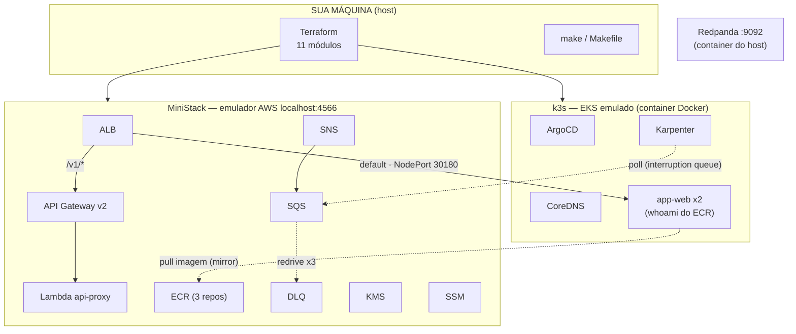

# Estrutura do repositório

Mapa completo do `eksTestSite`: o que é cada pasta, módulo e script, e como os três planos do ambiente se conectam.

## Visão geral

O ambiente tem três planos: o **Terraform** que provisiona tudo, o **EKS emulado** (k3s real em container Docker) e o **emulador AWS** (MiniStack em `localhost:4566`).



## Árvore do repositório

```
eksTestSite/
├── README.md                    # visão geral, quick start, comandos, peculiaridades
├── Makefile                     # 26 targets (ver seção Comandos do README)
│
├── docs/
│   └── estrutura.md             # este arquivo
│
├── k8s/                         # manifests Kubernetes (fonte do ArgoCD)
│   ├── app/
│   │   ├── namespace.yaml       # namespace "app"
│   │   ├── deployment.yaml      # app-web x2, imagem do ECR, probes /health
│   │   └── service.yaml         # NodePort 30180 → container 80
│   └── argocd/
│       └── app-web-application.yaml  # Application ArgoCD (repo GitHub, self-heal)
│
├── scripts/                     # utilitários do host
│   ├── ensure-cluster-up.sh     # pre-flight de apply/destroy/create (auto-clean pós-reset)
│   ├── patch-ministack.sh       # patch idempotente do alb.py (shapes aws provider v6)
│   └── setup-ssh-keys.sh        # gera ed25519 (auth+signing) e configura git
│
├── terraform/                   # raiz do stack
│   ├── main.tf                  # wiring dos 11 módulos (ordem de dependência)
│   ├── variables.tf             # 17 variáveis (endpoint, cluster, kafka, ecr, toggles)
│   ├── terraform.tfvars         # parametrização local
│   ├── locals.tf                # prefixo, kubeconfig_path (abspath), tags, endpoint in-cluster
│   ├── provider.tf              # provider aws (creds fake + endpoints :4566), k8s, helm
│   ├── versions.tf              # pin de versões (terraform + providers)
│   ├── outputs.tf               # outputs agrupados por módulo (cluster, elb, messaging…)
│   ├── .gitignore               # ignora state e .terraform/
│   └── .kube/                   # kubeconfig GERADO (ignorado no git)
│
├── assets/readme/               # hero.svg + architecture.svg (README)
├── generated-diagrams/          # PNGs do MCP diagrams (ignorado — regenerável)
├── .github/workflows/ci.yml     # fmt -check + validate + tflint
└── .zcode/config.json           # MCP diagrams-mcp do workspace
```

## Módulos Terraform (`terraform/modules/`)

| Módulo | Responsabilidade | Detalhes que importam |
|---|---|---|
| `networking` | VPC, subnets (2 AZs), security groups | base de tudo; alimentado por todos |
| `iam` | Roles do EKS (cluster/node) e Karpenter + instance profile | roles emuladas |
| `kms` | Chave simétrica `ministack` | usada por ECR e SSM |
| `ssm` | Parâmetros `/ministack/app/*` | sofre drift eterno de `key_id` (emulador) |
| `messaging` | SNS `ministack-events` → SQS `ministack-queue` + `ministack-dlq` | `redrive_policy` maxReceiveCount=3 |
| `ecr` | 3 repositórios (`app-api`, `app-web`, `app-worker`) | `force_delete=true` (destroy); lifecycle 5 imagens |
| `kafka` | Cluster MSK (stub via CLI — provider não suporta `DescribeClusterV2`) | broker real = Redpanda do host; bootstrap estático |
| `apigateway` | API v2 HTTP + Lambda proxy `/v1/*` | código em `lambda/index.py`, zip versionado |
| `elb` | ALB + listeners + 2 target groups | `ministack-tg` (default, `target_type=ip`, healthcheck `/health`) e `ministack-tg-api` (instance → hostname APIGW, atualizado via output) |
| `eks` | `aws_eks_cluster` + node group + kubeconfig via `docker exec` | scripts: `host_gateway.sh` (IP do gateway do bridge); `cluster_created_at` como trigger |
| `addons` | ArgoCD + Karpenter via helm; patch CoreDNS NodeHosts | trigger `cluster_created_at` re-aplica ao recriar cluster |
| `app` | Deploy dos manifests `k8s/app` + registro do node no ALB | scripts: `apply.sh` (retry + rollout best-effort), `register_targets.sh` (idempotente) |

## Regras de ouro do layout

1. **Tudo que roda no cluster nasce em `k8s/`** — o Terraform só aplica o que está lá; o ArgoCD sincroniza o mesmo path (fonte única).
2. **Scripts de host vivem em `scripts/`** — nada de lógica inline no Makefile além de orquestração curta.
3. **Estado é descartável por design** — `terraform.tfstate*`, `.kube/` e `generated-diagrams/` são ignorados; o emulador não persiste e o pre-flight se vira.
4. **Peculiaridades do emulador ficam no README** (seção própria) — este doc descreve *o que é cada coisa*; lá está *como depurar quando o emulador te surpreende*.
